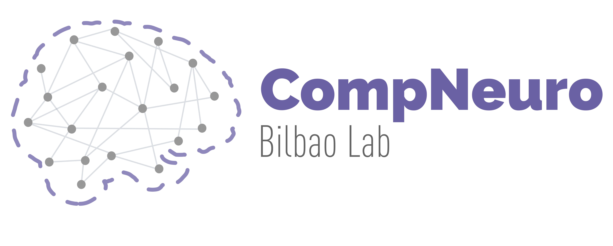

# compneuro-anatproc
This repo conatins the anatomical (T1) preprocessing and analysis code used by the Computational Neuroimaging Lab at Biocruces Bizkaia HRI. 


## Prerequisites
### Software
All the code can be executed using docker. To build the image you need to install first [docker](https://docs.docker.com/engine/install/) and make:

```bash
sudo apt install make
```

But, if you want to install all neuroimaging software used to preprocess the data, here you have the list! 

* [ANTs](http://stnava.github.io/ANTs/)
* [FSL](https://fsl.fmrib.ox.ac.uk/fsl/fslwiki)

### Data structure
Raw data should be stored in [BIDS format](https://bids.neuroimaging.io/) inside a folder named "data"

## Getting started

First, create an environment variable where your data is placed. 

```bash
export PROJECT_PATH=/path/to/your/project
```

You can now build the docker container:

```bash
sudo make build
make dev
```

### Usage

For anatomical image preprocessing run:

```bash
src/apreproc_launcher.sh
```

If you want to calculate the head size (vscale), gray matter and white matter volume of each participant, run (after `apreproc_launcher`):

```bash
utils/brainmeasures.sh
```

## Outputs
The following outputs will be generated:

```
/path/to/your/project/
├──Preproc
│   ├── BET
│   │   ├── sub-XXX_T1w_brain.nii.gz
│   ├── ProbTissue
│   │   ├── sub-XXX_T1w_brain_corticalGM.nii.gz
│   │   ├── sub-XXX_T1w_brain_CSF.nii.gz
│   │   ├── sub-XXX_T1w_brain_subcorticalGM.nii.gz
│   │   ├── sub-XXX_T1w_brain_WM.nii.gz
```

In `BET` folder you will find the brain extracted images of each participant and in `ProbTissue` the probability maps of each brain tissue. If you run `brainmeasures.sh` you will also find `brainmeasures.tsv` in `data` folder.

## Cite
Please, if you want to use this code in your publications, cite this work:

**Multimodal lesion network mapping to predict sensorimotor behavior in stroke patients**.
Antonio Jimenez-Marin, Nele De Bruyn, Jolien Gooijers, Alberto Llera, Sarah Meyer, Kaat Alaerts, Geert Verheyden, Stephan P. Swinnen, Jesus M. Cortes.
*bioRxiv*. 2021. doi: https://doi.org/10.1101/2021.12.23.473973
